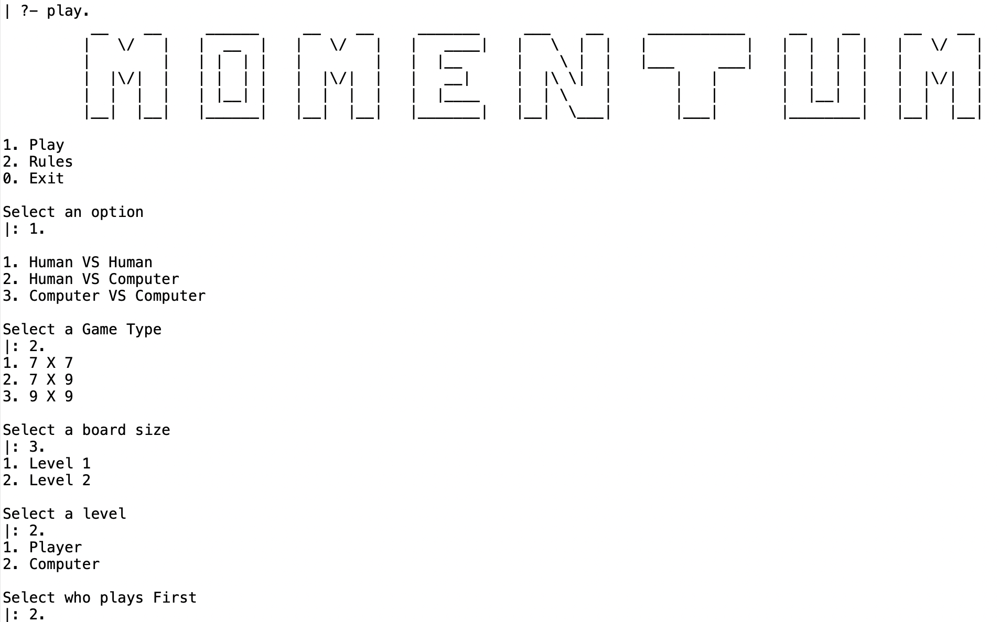
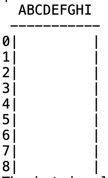
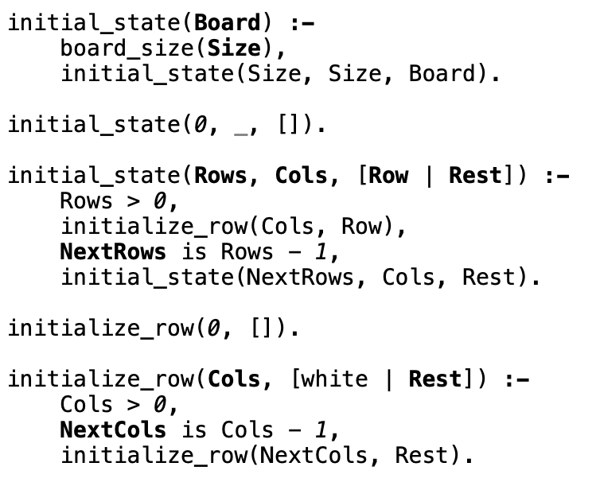
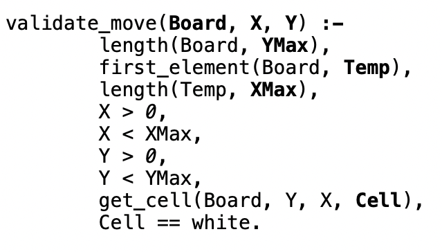

# Momentum

## Group Momentum_1
- Davide Pinto Teixeira - up202109860
- Maria Abreu da Costa - up202108849


## Instalation and Execution
To install the game, download the PFL_TP1_T09_Momentum_1.zip file and unzip it. Inside the 'src' directory, locate the 'play.pl' file, consult it, and start the game by executing the predicate play/0. You can use the following commands to run the game:

```
consult('play.pl').
play.
```

## Description of the game
[Momentum](https://boardgamegeek.com/boardgame/73091/momentum/files) is a game where players take turns placing their counters on an empty cell of the game board. After placing a counter, it pushes the last counter in all the straight lines in the 8 adjacent directions (vertical, horizontal, and diagonal) away from it. If the counters are pushed to the edge of the board, they are returned to their respective owners. The aim of the game is to have all of one's counters on the board at the end of their turn to win. The game supports three different board sizes: 7x7, 7x9, and 9x9. The number of counters allocated to each player varies based on the board size.

## Game Logic


- ### Internal Game State Representation

The game state is represented by several parameters, including:

- The game board, which is a pivotal component of the game.
- The current player (red or blue). The game always starts with the blue player.
- The current round of the game.

Depending on the game mode, additional parameters might include:

- The level(s) of the bot.
- Who plays first (in the case of player vs. computer).


- ### Game State Visualization
- 
At the beginning of the game, players are presented with options to "Play," "View Rules," or "Exit." Selecting "Play" allows them to configure the game settings, including the game mode (Human VS. Human, Human VS. Computer, or Computer VS. Computer) and the game board size (7x7, 7x9, or 9x9). In the Human VS. Human mode, the game commences after these choices. In other modes, players can specify the difficulty level (Level 1 or Level 2) and determine which player starts the game. An example interaction is demonstrated in the image below.

<p align="center">
  
</p>
During the game, the current state of the game is displayed using the display_game predicate, which prints the current state of the board.

<p align="center">
  
</p>
To create the initial state of the game, the initial_state predicate is used, which generates an empty board.

<p align="center">
  
</p>


- ### Move Validation and Execution

When making a move, it is essential to ensure that the move is valid within the context of the current game state and rules. To accomplish this, the validate_move predicate is employed. According to the rules, the cell a player wants to place a counter must be empty (represented as 'white' in our game) and cannot be on the board's edges.

<p align="center">
  
</p>

- ### List of Valid Moves

The valid_moves predicate is responsible for generating a list of all possible cells where a player can place their counter.

- ### End of Game
- 
The game concludes when one of the players successfully places all of their counters on the game board. This is determined by counting the number of counters on the board after each move. If the count matches the total number of counters initially allocated to each player, the player wins. This is represented by the game_over predicate, which verifies, after each turn, if a player has all their counters on the board. If so, the game ends, and that player is declared the winner.

- ### Game State Evaluation

The game state is evaluated based on the current round number.

- ### Computer plays
  For the computer's moves, two strategies are employed:
    - random moves in level 1, where the computer chooses random values for the column and row and checks if the move is valid.
    - Greedy moves in level 2.

## Conclusions
The game was developed with three different modes (Player vs. Player, Player vs. Computer, and Computer vs. Computer) and supports three distinct board sizes (7x7, 7x9, and 9x9). The modes involving the computer offer two levels of difficulty, adding significant diversity to the gameplay. Every user interaction is thoroughly validated to ensure a smooth gaming experience. The main challenge encountered was organizing the code, which is a feature that can be improved. Overall, the project provided a valuable opportunity to solidify our understanding of the logical programming concepts learned in class.

## Bibliography

[Sicstus Prolog Homepage](https://sicstus.sics.se/documentation.html)

[Momentum Board Game Page](https://boardgamegeek.com/boardgame/73091/momentum)

